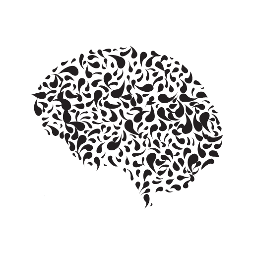

<div align="center">
  <div align="center">
      
  </div>
  <h3 align="center">Cerebro</h3>
  <p>
    A bot to manage the house and roomers
  </p>
  <p align="center">
    <a href="https://github.com/eocode/Cerebro-Bot/blob/master/LICENSE" target="__blank">
      	
    </a>
    <a href="https://github.com/ambv/black" target="__blank">
        
    </a>
    
  </p>
</div>

## Features

### Basic
* Telegram integration
* Basic conversations
* Log transactions

### Roomer assistant
A simple interaction for manage roomers in a home

* Manage accounts
  * Users
* Payments
  * Invoice
  * Payment details
* Wifi access management
  * Password
  * Add Devices to network
* Report issues
* Buy products

## Development principles

* Agile
* DDD
* POO

## Requirements for numpy
```shell
sudo apt-get install libatlas-base-dev
```

## How to install?

### Dependencies

```pip
pip freeze > requirements.txt
```

### Migrations

Create migration

```bash
alembic revision --autogenerate -m "first migration"
```

Run migration

```bash
alembic upgrade head
```

Rollback
```bash
alembic downgrade -1
```

History

```bash
alembic history
```

### Run program

```bash
python main.py
```